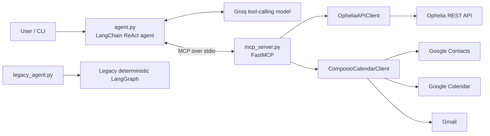

# Ophelia ReAct + MCP Architecture

The default CLI is a conversational ReAct agent. It decides which capability to
use from the conversation and tool observations; there is no fixed booking
state-machine path.



## Runtime loop

```mermaid
flowchart TD
    input[User message] --> reason[Model reasons over conversation]
    reason --> decide{Need a tool?}
    decide -->|yes| call[MCP tool call]
    call --> observe[Observe structured result or error]
    observe --> reason
    decide -->|missing input or consent| ask[Ask the user]
    decide -->|done| answer[Grounded response]
    ask --> input
```

`agent.py` starts `mcp_server.py` as a local stdio subprocess, discovers its
tools through `langchain-mcp-adapters`, and passes them to `create_agent`.
Conversation messages are retained across CLI turns so clarification, venue
selection, consent, OTP, and status follow-ups remain contextual.

## MCP tools

| Domain | Tools |
| --- | --- |
| Ophelia | `search_venues`, `search_availability`, `create_booking`, `get_booking`, `continue_booking`, `cancel_booking` |
| Composio | `resolve_contact_email`, `check_calendar_availability`, `create_calendar_event`, `send_guest_invite_email` |

The clients remain transport adapters and are instantiated only inside the MCP
server. The ReAct agent never imports or calls `OpheliaAPIClient`.

## Safety boundary

Consequential MCP tools require `user_confirmed=true`; the server rejects calls
without it. `create_booking` also requires a stable idempotency key. The system
prompt requires grounded details before consent, treats `get_booking` as the
authoritative status, limits polling, and prevents secrets from being echoed.

`--connect-google` (and the old `--connect-calendar` alias) remains a setup-only
CLI operation because its browser authorization flow must run outside MCP stdio.

## Legacy flow

The previous fixed LangGraph implementation is preserved in `legacy_agent.py`
for comparison and rollback. It is not the default runtime.
